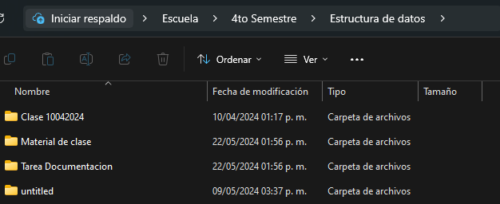

#Hecho por Armin Posadas Flores

# **Comandos para git**

Para inicializar un repositorio local primero seleccionas una carpeta a elegir y te vas a su direccion usando cd en la
terminal luego una vez dentro se utiliza

```
git init
```
Despues para agregar un archivo se utiliza
```
git add <file>
```
en la parte de <file> se pone el nombre y extension de tu archivo a escoger, en cambio si quieres agarrar multiples
archivos utilizas "git add ." para agregar todos los archivos dentro del origen (en donde utilizaste el init).
```
$ git commit -m "texto_de_ejemplo"
```
Se encarga de Confirmar los cambios rastreados y los prepara para enviarlos a un repositorio remoto. Para eliminar esta 
confirmación y modificar el archivo, se usa ```git reset "Modo de eliminacion" HEAD~1```, dentro de "modo de eliminacion"
se pueden utilizar 3 (tecnicamente mas de 3 pero solo nos importa 3) los cuales son, "--soft", "--mixed" y "--hard".

-soft: no toca archivos en el índice.

-mixed: resetea los índices pero no los archivos.

-hard: cambia absolutamente todo.

si por ejemplo tu archivo para mandar al github quieres que tenga texto podrias usar la funcion.
```
echo "Texto de ejemplo" >> ArchivoEjemplo.txt 
```
De esa forma podrias escribir texto dentro de ese archivo.

Ahora para vincular tu proyecto local al remoto se utiliza el comando.
(Nota debes crear el repositorio remoto dentro del github)
```
git remote add <remote_name> <remote_repo_url>
```
En donde <remote_name> es el nombre que tiene el repositorio y <remote_repo_url> es el url del repositorio.
```
git push -u <remote_name> <local_branch_name>
```
Ya por ultimo este codigo se encarga de hacer push al repositorio remoto poniendo el nombre de este mismo y la branch de
donde quieres enviarlo.

# **Creando y enviando mi repositorio a git hub**



Primero me diriji a la carpeta donde tenia todos mis archivos relacionados a la clase incluyendo proyectos y tareas.


Luego utilize el git init para inicializar mi repositorio local dentro de terminal.


Luego me cambie a git bash para agregar todos los archivos usando git add . con el punto representando que queria todos 
los archivos dentro de la carpeta en el repositorio.


Una vez que todos los archivos estaban en el repositorio le di en git commit -m con una breve descripcion.


Luego de crear un repositorio remoto en git hub lo vincule con el local para mandar todos mis archivos ahi, junto con el
nombre del repo y su vinculo.


Finalmente le di en push con el nombre del repositorio al que deberian ir y a cual branch.


Aqui una muestra de como termino quedando dentro del repositorio remoto.

Ahora realize cambios al documento y tengo que volver a hacer push, para eso regreso a la terminal y escribo


Agregara todos los archivos incluyendo los nuevos.


Luego se hace el commit con la descripcion del cambio para ya por ultimo darle un push.


De esa forma el repositorio ya esta completo con todos los trabajos que he hecho incluyendo este.

